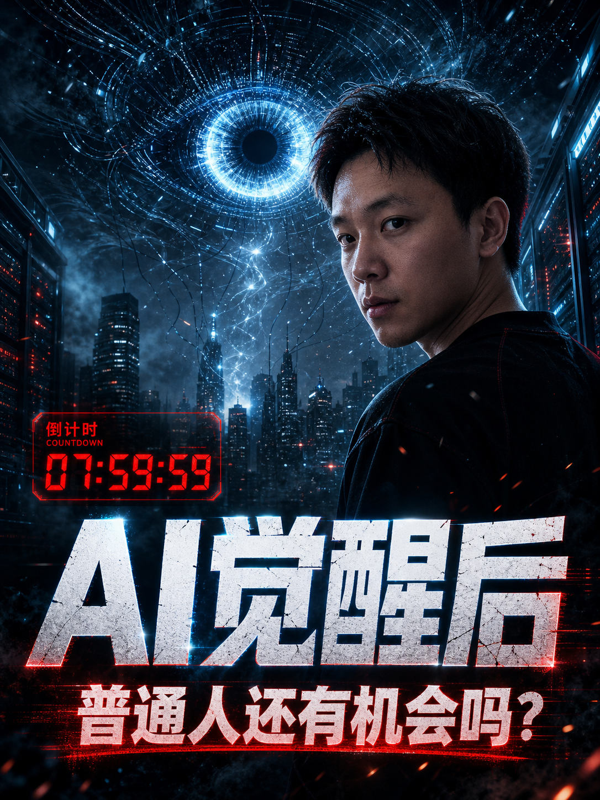

# Video Cover Maker Skill

一个面向短视频创作者的中文视频封面生成 Skill，用来把标题、文案、脚本、对标图或个人形象照，转成更有设计感、更有网感、更容易被点击的视频封面。

它不是单纯的生图提示词，而是一套封面创作工作流：先判断视频的点击理由，再选择合适的视觉模板、标题层级、人物位置、画面符号和平台比例，最后产出适合小红书、抖音、视频号、B 站等平台的封面方案或成图。

## 功能特点

- 根据标题、文案或脚本生成视频封面
- 支持竖屏 `3:4` 和横屏 `4:3`
- 内置多套爆款网感封面模板
- 支持参考对标图进行风格复刻
- 支持保存用户本人形象照，后续自动复用
- 默认追求强设计感、强网感、强点击欲
- 强调封面的主体、层次、材质、光影、动线和信息流缩略图冲击力

## 示例展示

### AI 工作流 / 主理人封面

| 竖屏 | 横屏 |
|---|---|
|  |  |
|  |  |

### 杂志批注 / 赛博科技 / 产品发布

| 竖屏 | 横屏 |
|---|---|
|  |  |
|  |  |

### 电影感 / 调查报道 / 街头拼贴 / 未来工厂

| 竖屏 | 横屏 |
|---|---|
|  |  |
|  |  |

## 适用场景

- AI 知识类视频封面
- 自媒体口播封面
- 小红书、抖音、视频号、B 站封面
- 个人品牌主理人封面
- 工具教程、内容创作、AI 工作流类封面
- 爆款视频选题的视觉包装

## 内置风格

Skill 内置多种封面方向：

- 主理人涂鸦爆款封面
- 爆款观点冲突封面
- 科技感强答案封面
- 反差前后对比封面
- 人物故事悬念封面
- 极简大字爆点封面
- 产品发布会工作台封面

这些模板不是固定皮肤，而是点击机制、视觉结构和构图语言。使用时会根据标题、文案、平台和素材自动选择最合适的方向。

## 设计理念

好的视频封面不是装饰，而是点击理由的视觉化。

这个 Skill 会优先提炼视频里的核心冲突、结果、悬念或利益点，再把它转化成封面上的标题、人物、视觉符号和构图。

目标是让观众在信息流里一眼看懂：

> 这条视频和我有关，而且我想点进去看。

## 示例请求

```text
帮我做一个竖屏封面，标题是：90%的人用错Skill
```

```text
用我的形象照，做一个横屏封面，主题是 AI 工作流
```

```text
参考这张对标图，帮我复刻一个小红书封面
```

```text
随便帮我做几组 AI 相关的爆款封面，横屏竖屏都要
```

## 目录结构

```text
video-cover-maker/
├── SKILL.md
├── README.md
├── agents/
│   └── openai.yaml
├── references/
│   ├── style-templates.md
│   ├── reference-replication.md
│   └── portrait-library.md
├── assets/
│   ├── user-photos/
│   └── reference-covers/
└── examples/
    ├── 01-ai-stop-learning-wrong-vertical.png
    ├── 02-ai-first-workflow-horizontal.png
    └── ...
```

## 说明

- `assets/user-photos/` 用来保存用户本人形象照。公开仓库中只保留占位文件，不包含私人照片。
- `examples/` 中的图片是示例封面，用于展示这个 Skill 的视觉方向。
- 如果图片生成模型无法稳定输出准确中文，建议让模型生成带有清晰留白的底图，再用设计工具手动叠加中文标题。
